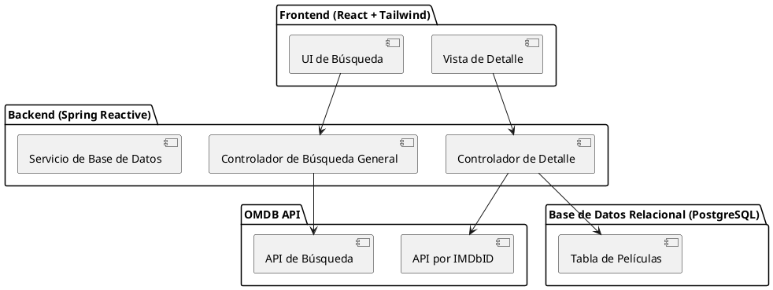

== Method

=== Arquitectura de la Aplicación

La aplicación sigue utilizando Spring Reactive y PostgreSQL, pero se añade la funcionalidad de autenticación y autorización con JWT. Los componentes clave son:

- **Frontend (React + Tailwind):** Maneja la interacción del usuario, incluyendo la autenticación.
- **Backend (Spring Reactive):** Provee servicios REST para:
  - Consultar la OMDB API.
  - Manejar CRUD para contenidos, colecciones y usuarios.
  - Autenticación basada en tokens JWT.
- **Base de Datos Relacional (PostgreSQL):** Incluye las tablas y relaciones definidas.

=== Esquema de Base de Datos

Aquí está el esquema actualizado de la base de datos:

```sql
create table user_app (
  id serial  primary key,
  username text not null unique,
  email text not null unique,
  password text not null
);

create table tokens (
  id serial primary key,
  user_id bigint references user_app (id),
  token text not null,
  is_active boolean default false
);

create table movies (
  id serial primary key,
  title text not null,
  release_year int,
  rating float
);

create table actors (
  id serial primary key,
  name text not null,
  birth_year int
);

create table directors (
  id serial primary key,
  name text not null,
  birth_year int
);

create table genres (
  id serial primary key,
  name text not null
);

create table movie_actors (
  movie_id bigint references movies (id),
  actor_id bigint references actors (id),
  primary key (movie_id, actor_id)
);

create table movie_directors (
  movie_id bigint references movies (id),
  director_id bigint references directors (id),
  primary key (movie_id, director_id)
);

create table movie_genres (
  movie_id bigint references movies (id),
  genre_id bigint references genres (id),
  primary key (movie_id, genre_id)
);

create table ratings (
  id serial primary key,
  movie_id bigint references movies (id),
  source text,
  value text
);

create table favorite_movies (
  user_id bigint references user_app (id),
  movie_id bigint references movies (id),
  primary key (user_id, movie_id)
);

create table collections (
  id serial primary key,
  user_id bigint references user_app (id),
  name text not null
);

create table collection_movies (
  collection_id bigint references collections (id),
  movie_id bigint references movies (id),
  primary key (collection_id, movie_id)
);
```

=== Diagrama de Componentes


